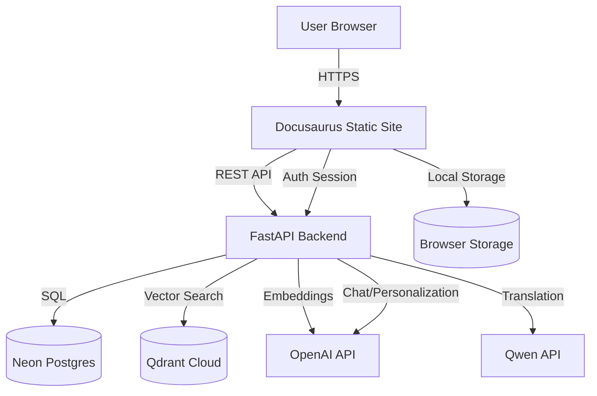

# Research & Technology Decisions

**Feature**: Physical AI & Humanoid Robotics Textbook Platform
**Date**: 2025-12-09
**Status**: Completed

## Overview

This document captures research findings and technology decisions for implementing an interactive educational platform combining static textbook content with AI-powered learning features.

## Key Technology Decisions

### 1. Static Site Generator: Docusaurus v3

**Decision**: Use Docusaurus v3 as the primary frontend framework

**Rationale**:
- **Purpose-built for documentation**: Designed specifically for technical documentation and educational content
- **Markdown-native**: Authors write in Markdown, which is familiar and version-control friendly
- **Built-in features**:
  - Full-text search out of the box
  - Mobile-responsive by default
  - Versioning support for content iterations
  - i18n (internationalization) system for multilingual support (needed for Urdu translation)
  - Sidebar navigation with automatic TOC generation
- **React-based**: Allows custom components for chatbot, personalization buttons, translation toggles
- **Static output**: Generates static HTML/CSS/JS deployable to GitHub Pages (free hosting)
- **Performance**: Pre-rendered pages load quickly, meeting <2s navigation requirement

**Alternatives Considered**:
- **Gatsby**: More general-purpose, requires more custom configuration for documentation features
- **VuePress**: Strong for documentation but smaller ecosystem than Docusaurus
- **NextJS**: Overkill for static content, requires hosting for SSR benefits
- **Custom React SPA**: Would need to rebuild search, navigation, mobile responsiveness from scratch

**Implementation Notes**:
- Use Docusaurus `swizzling` to customize theme components
- Integrate custom React components via MDX (Markdown + JSX)
- Configure for both English and Urdu locales

---

### 2. Backend Framework: FastAPI

**Decision**: Use FastAPI (Python 3.11+) for REST API backend

**Rationale**:
- **Automatic OpenAPI generation**: Self-documenting API with interactive Swagger UI
- **Async support**: Native async/await for concurrent request handling (important for AI API calls)
- **Type safety**: Pydantic models provide request/response validation with type hints
- **Performance**: Comparable to Node.js/Go for I/O-bound operations (our use case)
- **Python ecosystem**: Direct access to AI/ML libraries (OpenAI SDK, sentence-transformers, etc.)
- **Developer experience**: Fast development with automatic validation, clear error messages

**Alternatives Considered**:
- **Flask**: Simpler but lacks async support and automatic API documentation
- **Django**: Too heavyweight for API-only service, includes unnecessary ORM/admin features
- **Node.js (Express/NestJS)**: Would require separate Python service for AI operations anyway
- **Go (Gin/Fiber)**: Excellent performance but Python better for rapid AI/ML prototyping

**Implementation Notes**:
- Use `uvicorn` as ASGI server
- Structure with layered architecture (routes → services → models)
- Implement middleware for CORS, rate limiting, authentication

---

### 3. Database: Neon Serverless Postgres

**Decision**: Use Neon Serverless Postgres for user data and profiles

**Rationale**:
- **Serverless**: Auto-scales from zero, pay-per-use pricing (free tier: 512MB, 1 project)
- **PostgreSQL compatibility**: Full Postgres features (JSONB for flexible profile data, indexes, constraints)
- **Branching**: Database branching for development/staging/production
- **Connection pooling**: Built-in pooling reduces connection overhead
- **Backups**: Automated point-in-time recovery

**Alternatives Considered**:
- **SQLite**: Simple but not suitable for multi-user production deployment
- **Supabase**: Similar to Neon but includes auth/storage we don't need (Better-Auth handles auth)
- **PlanetScale**: MySQL-compatible but free tier less generous than Neon
- **MongoDB Atlas**: NoSQL appropriate but relational data model fits our use case better

**Schema Strategy**:
- Use SQLAlchemy ORM for type-safe database operations
- Alembic for schema migrations
- Store user profiles with JSONB for flexible interest/background data

---

### 4. Vector Database: Qdrant Cloud

**Decision**: Use Qdrant Cloud for vector embeddings and semantic search

**Rationale**:
- **Free tier**: 1GB storage, sufficient for ~10-15 chapters of embedded content
- **Hybrid search**: Native support for vector + keyword (sparse) search in single query
- **Python client**: First-class Python SDK with async support
- **Filtering**: Metadata filtering (e.g., filter by chapter, module) during vector search
- **Performance**: Optimized for retrieval speed (<100ms for similarity search)
- **Managed service**: No infrastructure management required

**Alternatives Considered**:
- **Pinecone**: Excellent but free tier limited to 1 index, less generous storage
- **Weaviate**: Strong hybrid search but requires self-hosting or paid cloud
- **Milvus**: Open-source but requires infrastructure management
- **Embedding in Postgres (pgvector)**: Possible but Qdrant optimized for vector operations

**Embedding Strategy**:
- Use OpenAI `text-embedding-3-small` (1536 dimensions, $0.02/1M tokens)
- Chunk chapters into ~500-token segments for fine-grained retrieval
- Store chapter/module metadata for filtering
- Implement keyword extraction for sparse vector (BM25-style) component

---

### 5. Authentication: Better-Auth

**Decision**: Use Better-Auth for user authentication and session management

**Rationale**:
- **TypeScript-native**: Provides full type safety across frontend/backend
- **Framework-agnostic**: Works with FastAPI backend + React frontend
- **Built-in features**: Email/password auth, session management, CSRF protection
- **Lightweight**: No vendor lock-in, simple integration
- **Extensible**: Supports custom fields for profile questionnaire data

**Alternatives Considered**:
- **Auth0**: Powerful but overkill for simple email/password auth, adds third-party dependency
- **Supabase Auth**: Ties us to Supabase ecosystem
- **Custom JWT**: Would need to implement session management, token refresh, security measures from scratch
- **Passport.js**: Node.js-specific, doesn't integrate cleanly with FastAPI

**Implementation Notes**:
- Store sessions in Postgres (Better-Auth supports database sessions)
- Implement 2-step signup: basic info → background questionnaire
- Use HTTP-only cookies for session tokens (XSS protection)

---

### 6. AI Services

#### 6.1 Text Embeddings: OpenAI text-embedding-3-small

**Decision**: Use OpenAI `text-embedding-3-small` for vector embeddings

**Rationale**:
- **Cost-effective**: $0.02 per 1M tokens (vs $0.13 for text-embedding-3-large)
- **Performance**: 1536 dimensions, sufficient quality for educational content retrieval
- **MTEB Score**: 62.3% (competitive with larger models for general-purpose embedding)
- **OpenAI ecosystem**: Same API as GPT models, unified authentication

**Alternatives Considered**:
- **sentence-transformers (all-MiniLM-L6-v2)**: Free, self-hosted but lower quality (56% MTEB)
- **Cohere embeddings**: Strong quality but $0.10/1M tokens (5x more expensive)
- **text-embedding-3-large**: Better quality (64.6% MTEB) but 6.5x more expensive

**Token Budget Impact**:
- ~50,000 tokens for initial corpus embedding (10-15 chapters × ~3,000 tokens/chapter)
- Budget: 58,000 tokens → fits within constraint

#### 6.2 Chat Generation: OpenAI GPT-4o-mini

**Decision**: Use `gpt-4o-mini` for chatbot responses

**Rationale**:
- **Cost**: $0.15/1M input tokens, $0.60/1M output tokens (15x cheaper than GPT-4)
- **Speed**: Fast inference (<2s typical response time)
- **Quality**: Strong performance for educational Q&A with context
- **Context window**: 128K tokens (can include multiple chapter chunks)
- **Instruction following**: Good at citing sources, following formatting rules

**Alternatives Considered**:
- **GPT-4**: Better quality but prohibitively expensive for high-volume chatbot
- **Claude Sonnet**: Excellent quality but would require switching providers (OpenAI already used for embeddings)
- **Llama 3 (self-hosted)**: Free but requires infrastructure, slower inference

#### 6.3 Content Personalization: OpenAI GPT-4o-mini

**Decision**: Reuse `gpt-4o-mini` for personalized content generation

**Rationale**:
- **Reuse existing integration**: Already using OpenAI for chat
- **Sufficient quality**: Can rewrite explanations for different skill levels
- **Fast enough**: 5-second budget for personalization fits typical response time
- **Context handling**: Can process full chapter (128K context window)

#### 6.4 Translation: Qwen Turbo

**Decision**: Use Alibaba Cloud Qwen Turbo for Urdu translation

**Rationale**:
- **Urdu tokenization**: Qwen models specifically trained on multilingual data including Urdu
- **Better Urdu quality**: Outperforms GPT-3.5/4 for Urdu due to tokenizer design
- **Cost**: Comparable pricing to GPT-4o-mini
- **API compatibility**: OpenAI-compatible API interface

**Alternatives Considered**:
- **GPT-4o-mini**: Works but Urdu tokenization less efficient, lower quality
- **Google Translate API**: Machine translation, not LLM-based (worse context handling)
- **DeepL**: Doesn't support Urdu

**Implementation Strategy**:
- Parse Markdown to separate code blocks before translation
- Translate only prose content
- Preserve formatting (headers, lists, etc.)
- Cache translations in Postgres to reduce API calls

---

### 7. Hosting & Deployment

#### 7.1 Frontend: GitHub Pages

**Decision**: Deploy Docusaurus static site to GitHub Pages

**Rationale**:
- **Free**: No cost for public repositories
- **CDN**: Global content delivery for fast load times
- **HTTPS**: Automatic SSL certificate
- **CI/CD**: GitHub Actions for automatic deployment on push to main
- **Custom domain**: Supports custom domains if needed later

**Alternatives Considered**:
- **Netlify**: Similar features but GitHub Pages tighter integration with repo
- **Vercel**: Excellent but overkill for static site
- **Cloudflare Pages**: Strong option but GitHub Pages simpler for this use case

#### 7.2 Backend: Fly.io (Primary) or Render (Backup)

**Decision**: Deploy FastAPI backend to Fly.io free tier, Render as backup option

**Rationale for Fly.io**:
- **Free tier**: 3 VMs with 256MB RAM each, sufficient for API load
- **Global edge**: Deploy close to users for low latency
- **Docker-native**: Simple deployment with Dockerfile
- **Postgres support**: Can deploy Neon connection from any region
- **WebSocket support**: Future-proofs for real-time features if needed

**Rationale for Render (Backup)**:
- **Free tier**: 750 hours/month, 512MB RAM
- **Simpler setup**: No Docker required, deploy from GitHub directly
- **Automatic HTTPS**: SSL certificate provisioning

**Deployment Strategy**:
- Dockerize FastAPI application
- Use GitHub Actions for CI/CD
- Environment variables via platform secrets
- Health check endpoint for monitoring

---

### 8. Development Tools & CI/CD

**Linting & Formatting**:
- **Python**: Black (formatting), Flake8 (linting), mypy (type checking)
- **JavaScript/TypeScript**: ESLint, Prettier, TypeScript compiler

**Testing**:
- **Backend**: pytest, pytest-asyncio, pytest-cov (coverage), httpx (async test client)
- **Frontend**: Jest, React Testing Library, Playwright (E2E)

**CI/CD Pipeline** (GitHub Actions):
1. **Backend Tests**: Run on every PR
   - Lint with Flake8
   - Type check with mypy
   - Run pytest with coverage report
   - Fail if coverage <80%

2. **Frontend Tests**: Run on every PR
   - Lint with ESLint
   - Type check with TypeScript
   - Run Jest unit tests
   - Run Playwright E2E tests (subset)

3. **Deployment**: On merge to main
   - Build Docker image for backend → deploy to Fly.io
   - Build Docusaurus static site → deploy to GitHub Pages

---

### 9. Claude Code Skills (Content Authoring Tools)

#### 9.1 book-writer-skill.json

**Purpose**: Generate draft chapters from topic outlines

**Capabilities**:
- Input: Topic outline, learning objectives, target audience
- Output: Markdown chapter with:
  - Introduction with motivating examples
  - Sectioned content with progressive difficulty
  - Code examples with inline comments
  - Exercises (easy → hard)
  - Summary and further reading

**Constraints**:
- Must follow constitution's educational standards
- Include placeholders for tests (to be filled manually)
- Cite sources for technical claims

#### 9.2 code-reviewer-skill.json

**Purpose**: Review code examples for correctness and educational quality

**Capabilities**:
- Input: Code snippet, chapter context, target audience
- Output: Review report with:
  - Correctness assessment (syntax, logic, edge cases)
  - Style compliance (PEP 8, naming conventions)
  - Educational clarity (comments, variable names, complexity)
  - Suggestions for improvement
  - Test coverage recommendations

**Constraints**:
- Flag missing tests as violations
- Check against constitution's code quality standards

#### 9.3 exercise-generator-skill.json

**Purpose**: Generate practice exercises for completed chapters

**Capabilities**:
- Input: Chapter content, concepts covered
- Output: 5-10 exercises with:
  - Problem statement
  - Difficulty level (beginner/intermediate/advanced)
  - Learning objective tested
  - Solution outline (not full solution)
  - Expected output/behavior

**Constraints**:
- Range from reinforcement (apply concepts directly) to extension (combine multiple concepts)
- Aligned with chapter learning objectives

---

## Technology Stack Summary

| Layer | Technology | Version | Rationale |
|-------|------------|---------|-----------|
| **Frontend Framework** | Docusaurus | 3.x | Purpose-built for docs, i18n, mobile-responsive |
| **Frontend UI** | React | 18.x | Component-based, modern hooks API |
| **Backend Framework** | FastAPI | 0.104+ | Async, type-safe, auto-docs |
| **Backend Language** | Python | 3.11+ | AI/ML ecosystem, type hints |
| **Primary Database** | Neon Postgres | 14+ | Serverless, free tier, full SQL |
| **Vector Database** | Qdrant Cloud | Latest | Hybrid search, free tier, managed |
| **Authentication** | Better-Auth | Latest | Framework-agnostic, TypeScript-native |
| **Embeddings** | OpenAI text-embedding-3-small | - | Cost-effective, good quality |
| **Chat LLM** | OpenAI GPT-4o-mini | - | Fast, affordable, sufficient quality |
| **Translation LLM** | Qwen Turbo | - | Best Urdu support |
| **ORM** | SQLAlchemy | 2.x | Python standard, type-safe |
| **Migrations** | Alembic | 1.x | SQLAlchemy-integrated |
| **HTTP Client (Frontend)** | Axios | 1.x | Promise-based, interceptors |
| **Testing (Backend)** | pytest | Latest | Python standard, async support |
| **Testing (Frontend)** | Jest + React Testing Library | Latest | React standard |
| **E2E Testing** | Playwright | Latest | Cross-browser, modern API |
| **Linting (Python)** | Black + Flake8 + mypy | Latest | PEP 8 compliance, type checking |
| **Linting (JS/TS)** | ESLint + Prettier | Latest | Standard JavaScript style |
| **Frontend Hosting** | GitHub Pages | - | Free, fast CDN |
| **Backend Hosting** | Fly.io / Render | - | Free tier, Docker support |
| **CI/CD** | GitHub Actions | - | Native GitHub integration |

---

## Dependencies & Integration Points

---

## Performance Budget & Constraints

| Operation | Target | Strategy |
|-----------|--------|----------|
| **Page Navigation** | <2s | Static pre-rendering, CDN caching |
| **Chatbot Response** | <3s | Async retrieval + generation, response streaming |
| **Content Personalization** | <5s | Cache user profile, parallel LLM call |
| **Translation** | <5s | Cache translations in Postgres, lazy load |
| **API Latency (p95)** | <200ms | Index optimization, connection pooling |
| **Concurrent Users** | 100+ | Async backend, serverless database scaling |
| **Token Budget** | 58K tokens | Optimize prompts, cache embeddings, batch operations |

---

## Security Considerations

1. **Authentication**: HTTP-only cookies prevent XSS token theft
2. **API Rate Limiting**: Prevent abuse of AI endpoints (costly)
3. **Input Validation**: Pydantic schemas validate all API requests
4. **SQL Injection**: SQLAlchemy ORM prevents direct SQL string manipulation
5. **CORS**: Restrict API access to frontend domain only
6. **Secrets Management**: Environment variables for API keys (never commit)
7. **HTTPS**: Enforced on both GitHub Pages and Fly.io
8. **User Data**: Minimal PII collection, GDPR-style consent

---

## Cost Estimation (Monthly, Initial Load)

| Service | Usage | Cost |
|---------|-------|------|
| Neon Postgres | <512MB | $0 (free tier) |
| Qdrant Cloud | <1GB | $0 (free tier) |
| GitHub Pages | Static site | $0 (public repo) |
| Fly.io/Render | <750 hrs | $0 (free tier) |
| OpenAI Embeddings | ~50K tokens | $0.001 |
| OpenAI GPT-4o-mini | ~1M tokens | ~$1.00 |
| Qwen Translation | ~500K tokens | ~$0.50 |
| **Total** | | **~$1.50/month** |

**Scaling Considerations**:
- At 1,000 users with 10 chats/user/month: ~$15/month (still within budget)
- Free tiers sufficient for first 3-6 months
- Caching (translations, personalized content) reduces recurring AI costs

---

## Risks & Mitigation

| Risk | Impact | Mitigation |
|------|--------|------------|
| **Free tier limits exceeded** | Service degradation | Monitor usage, implement rate limiting, upgrade tier if needed |
| **AI API downtime** | Chatbot unavailable | Graceful fallback message, queue requests for retry |
| **Slow LLM responses** | Poor UX | Set aggressive timeouts (5s), show loading states, implement response streaming |
| **Poor translation quality** | User confusion | Allow toggle back to English, gather feedback for manual review |
| **Data loss** | User profiles lost | Automated Neon backups, export user data periodically |
| **Security breach** | User data exposed | Regular dependency updates, security scanning in CI, minimal PII storage |

---

## Next Steps (Phase 1)

1. Generate `data-model.md` with database schema
2. Generate API contracts in `contracts/openapi.yaml`
3. Create `quickstart.md` for local development setup
4. Update agent context with technology choices

